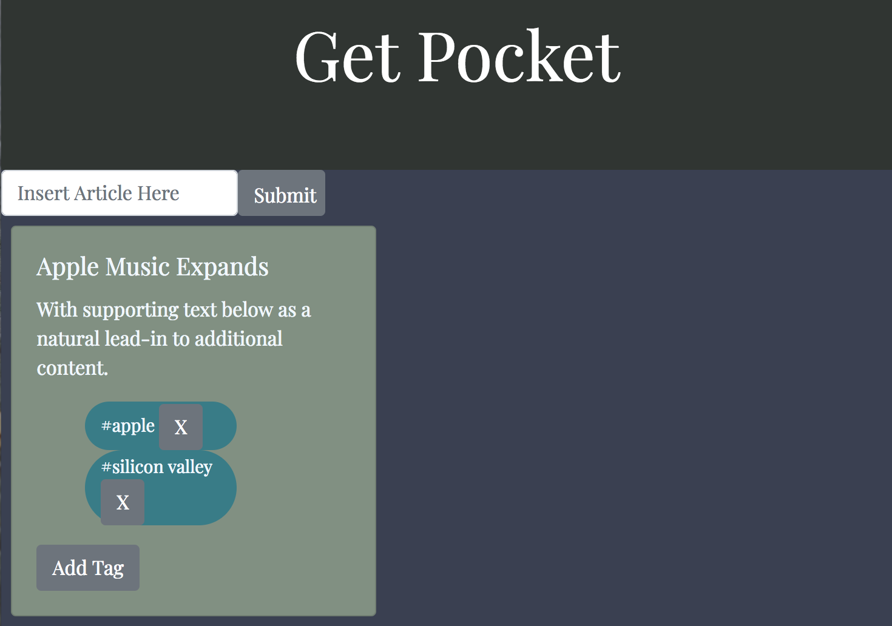

## Welcome to a Get Pocket mockup!

## Installation

Clone this repo onto your local desktop

Install dependencies
`npm install`

Run database
`mongod`

Run server
`node server.js`

Run application
`npm start`

## Technologies used
* [React](https://facebook.github.io/react/) - JavaScript library
* [Node.js](https://nodejs.org/en/) - JavaScript runtime environment for our back-end application
* [MongoDB](https://www.mongodb.com/) - Document-oriented NoSQL database
* [Express](https://expressjs.com/) - Node.js framework used
* [React Script](https://reactstrap.github.io/components/form/) - React Bootstrap components
